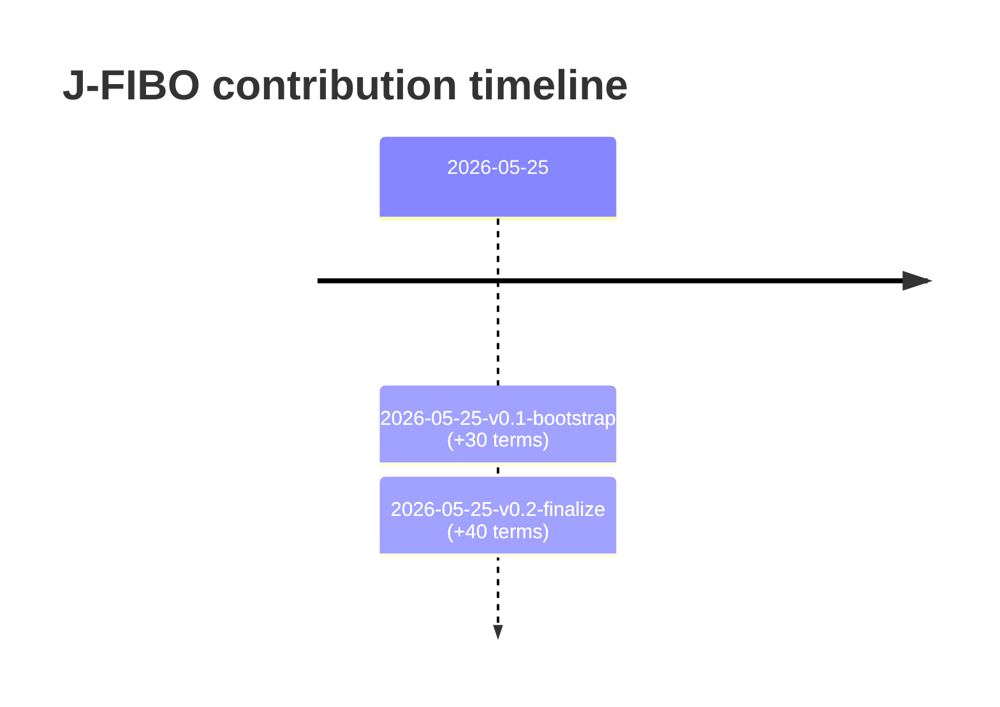

# J-FIBO Building Trajectory

Derived from `registry/terms.yaml` (per-term `contributed_by` + `session`) and `registry/contributors.yaml`. Every minted term carries the same attribution as `prov:wasAttributedTo` + `prov:wasGeneratedBy` triples in `ontology/jpfibo.ttl`, so this view is also queryable via SPARQL.

## Sessions

### 2026-05-25-v0.1-bootstrap

- date: 2026-05-25
- goal: Bootstrap J-FIBO v0.1 with EDINET alignment and information-status vocabulary.
- terms contributed: 30
- modules: information-status=12, disclosure-claim=8, core=4, edinet-alignment=3, institutional-context=3
- kinds: class=14, individual=7, object_property=6, datatype_property=3

### 2026-05-25-v0.2-finalize

- date: 2026-05-25
- goal: Finalize ontology with normative-status / reporting-regime / document-type / holder-role vocab, atomic claim types, and the EDINET-family `jpfibo:` prefix.
- terms contributed: 40
- modules: holder-role=9, reporting-regime=8, document-type=8, normative-status=7, disclosure-claim=7, core=1
- kinds: individual=24, class=7, object_property=7, datatype_property=2

## Contributors

### jfibo-wg-bootstrap

- role: editor
- organization: J-FIBO Working Group (provisional)
- terms attributed: 70

> Provisional editorial group seeding v0.x. Replace with named institutional
contributors as the working group formalizes (Digital Agency, FSA, JPX,
EDM Council Japan Chapter / FDUA / FISC).

## Mermaid timeline

